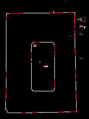
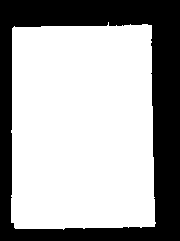
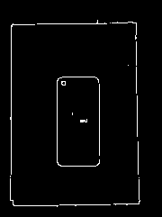
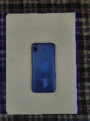
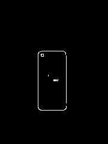
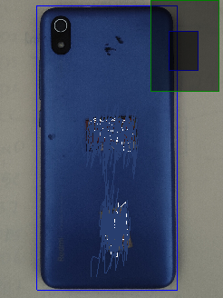
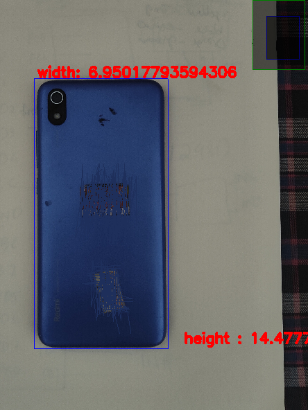

### python-BPMS -: 
    Boarder precision measurement System

Original Image 

Contour applied on detected edges

Erasing Mask 

After Erasing the outer Noise

Detected Papper

Erased Papper boarder:

Detected Object

Measured Dimension

